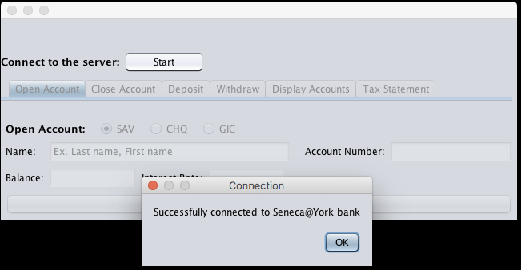
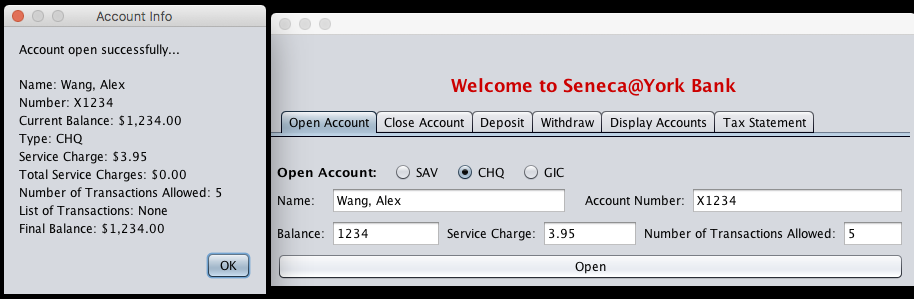
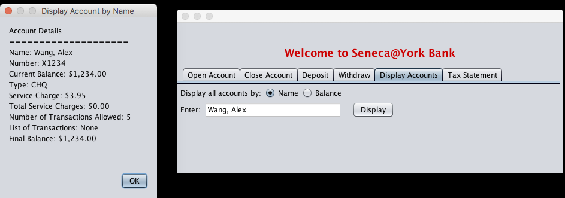

# bank-server-client-rmi

The purpose of this assignment is to learn to use Java remote method invocation (RMI)to allow a third party to create clients that will access the data on the server in a secure manner without the complexity of having to write the code to create a socket for the connections.

## Instructions
Due to lengthy instructions to compile and launch the client and server, please read the instructions written in README.docx. Instructions are present for both Windows and Mac users inside this file.

## Screenshots

For more screenshots please visit the [_screenshots_ folder](https://github.com/AlexWang-16/bank-server-client-rmi/tree/master/screenshots)
